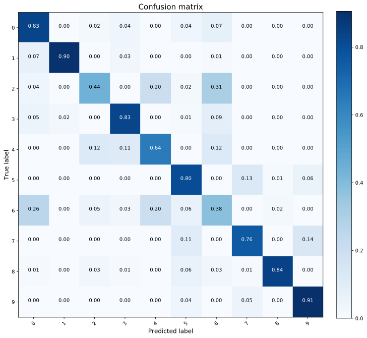

# Support Vector Machines and Logisitic Regression on the Fashion MNIST dataset
The full tutorial can be found in this link: https://federicoarenasl.github.io/SVM-LR-on-Fashion-MNIST/. There is also a ```SVM-LR-FMNIST-Tutorial.md``` file in this repository for those who prefer reading it from here directly.
# A brief introduction 
In this notebook we will explore the impact of implementing Principal Component Anlysis to an image dataset. For this, we will use the benchmark Fashion MNIST dataset, the link to this dataset can be found [here](https://github.com/zalandoresearch/fashion-mnist/tree/master/data/fashion). Indeed, the images from the dataset are 784-dimensional images. In this small tutorial we seek to explore if we can further compress the dimension of these images without loosing valuable information.

## Fashion MNIST Dataset
As described [here](https://github.com/zalandoresearch/fashion-mnist), the dataset contains 60k training examples, and 10k testing examples. Each training example is accomanied with a respective label, which can either be:
- 0 	T-shirt/top
- 1 	Trouser
- 2 	Pullover
- 3 	Dress
- 4 	Coat
- 5 	Sandal
- 6 	Shirt
- 7 	Sneaker
- 8 	Bag
- 9 	Ankle boot


## Final results
We find that the SVM model performs better than the logistic regression, with a training accuracy of ```90.84%,``` and a testing accuracy of ```87.65%```. The model outputs the following confusion matrix.

<p align="center">

</p>

We deepen our analysis by looking at the 2D decision boundary of our model.    

<p align="center">

</p>

